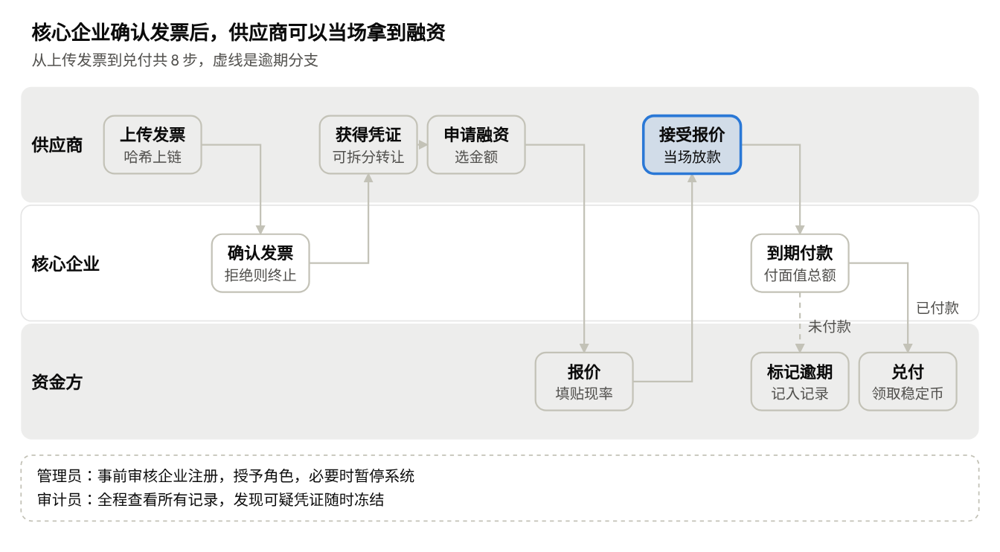
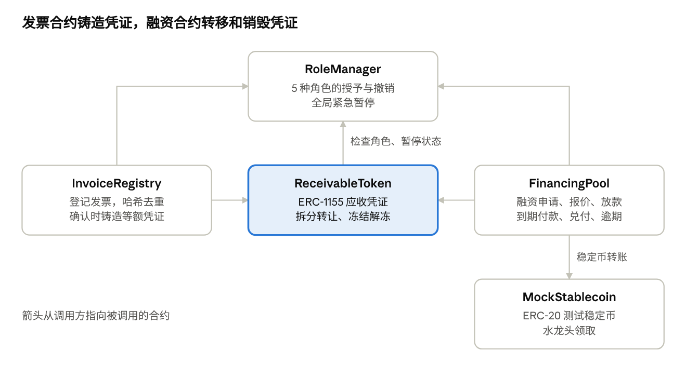

# 供应链金融 DApp 产品需求文档（PRD）

> **版本**：v1.0 (2026-10-08)  
> **作者**：@YANG SHUYI / NTU SC6113 课程项目组  
> **课程编号**：NTU SC6113  
> **技术栈**：Solidity (ERC-1155 / ERC-20) + Python Flask + Ethers.js / Web3 + SQLite/PostgreSQL + Render 部署  

---

## 1. 产品概述

本产品是一个供应链金融去中心化应用（Supply Chain Finance DApp）：供应商把核心企业确认过的应收账款上链，变成可以拆分、转让、融资的数字凭证，并从机制上防止同一张发票被重复融资。

### 1.1 要解决的问题
1. **中小供应商回款慢、融资难**：把货卖给大企业后，往往要等几个月才回款；又因为缺少信用记录，很难从银行拿到贷款。
2. **银行无法核实发票真伪**：同一张发票可能被拿到多家银行重复融资，各家银行之间又不共享数据。
3. **核心企业的信用传不下去**：二级、三级供应商和核心企业没有直接合同，借不到核心企业的信用。
> *注：具体数据和证据由成员 4 在研究阶段补充，放入技术报告。*

### 1.2 产品目标
- **快速放款**：核心企业在链上确认发票后，供应商能在几分钟内拿到银行放款。
- **防止重复融资**：同一张发票只能登记一次、融资一次，重复提交一律拦截。
- **信用可拆分转让**：应收凭证可以拆分转让给下一级供应商，让核心企业的信用往下传递。
- **全流程存证与审计**：所有关键操作都在链上留痕，审计员可以随时查看。

### 1.3 本期范围
| 做 | 不做 |
| :--- | :--- |
| 5 种角色的完整流程：登记发票、确认、拆分转让、融资、还款、审计 | 真实法币出入金，用测试稳定币（MockStablecoin）代替 |
| 部署在以太坊测试网（如 Sepolia） | 主网部署 |
| 管理员人工审核企业注册 | 对接真实的企业工商信息和 KYC |
| 发票文件存在链下，链上存哈希（SHA-256） | 对接税务系统核验发票真伪 |
| 资金方手动报价 | 自动信用评分、自动定价 |

### 1.4 技术栈（课程指定）
- **智能合约**：Solidity (OpenZeppelin 合约库，ERC-1155 凭证 + ERC-20 测试币)
- **后端**：Python Flask (配合 Web3.py 监听链上事件)
- **前端**：HTML + CSS + JavaScript (通过 Ethers.js 连接 MetaMask)
- **云端部署**：Render (Web Service + Gunicorn)
- **成果汇报**：演示视频上传 YouTube / 技术报告

---

## 2. 用户角色与权限

系统共设计 **5 种角色**（满足课程“至少 3 种角色”的要求）。每个钱包地址只对应一种角色，角色由管理员在链上授予。

| 角色 | 是谁 | 核心诉求 |
| :--- | :--- | :--- |
| **管理员 (Admin)** | 平台运营方 | 审核企业、分配角色、出问题时紧急暂停系统 |
| **供应商 (Supplier)** | 向核心企业供货的中小企业，包括二级供应商 | 尽快把应收账款变现或拆分转让 |
| **核心企业 (Core Enterprise)** | 采购方大企业 | 确认真实的应付账款，到期付款 |
| **资金方 (Financier)** | 银行或保理公司 | 放款给可信的应收账款，到期收回本息 |
| **审计员 (Auditor)** | 监管或审计机构 | 查看全部记录，发现可疑凭证时冻结 |

### 权限矩阵
> **说明**：`✓` 表示该角色可以执行，空白表示不允许。合约和后端都要做权限检查，前端仅做隐藏按钮不足以保证安全。

| 操作 | 管理员 | 供应商 | 核心企业 | 资金方 | 审计员 |
| :--- | :---: | :---: | :---: | :---: | :---: |
| 提交企业注册申请 | | ✓ | ✓ | ✓ | |
| 审核注册、授予或撤销角色 | ✓ | | | | |
| 紧急暂停或恢复系统 | ✓ | | | | |
| 上传发票 | | ✓ | | | |
| 确认或拒绝发票 | | | ✓ | | |
| 拆分、转让凭证 | | ✓ | | | |
| 申请融资 | | ✓ | | | |
| 报价、放款 | | | | ✓ | |
| 到期付款 | | | ✓ | | |
| 标记逾期 | | | | ✓ | |
| 冻结或解冻凭证 | | | | | ✓ |
| 查看自己相关的记录 | ✓ | ✓ | ✓ | ✓ | ✓ |
| 查看全部记录和事件日志 | ✓ | | | | ✓ |

---

## 3. 核心业务流程

主线是 **“上传发票 → 确认 → 生成凭证 → 融资 → 到期付款 → 兑付”**，演示视频按此主线进行。

> **流程说明**：
> 1. 供应商开具发票后，将发票元数据与文件哈希提交上链；
> 2. 核心企业查验发票并确认（若拒绝则流程终止）；
> 3. 确认后系统自动铸造等额应收凭证（ERC-1155）；
> 4. 供应商可选择拆分转让给二级供应商，或发起融资申请；
> 5. 资金方对融资申请提交贴现率报价；
> 6. 供应商接受报价，原子化完成放款（稳定币转账 + 凭证所有权划转）；
> 7. 发票到期时，核心企业向资金池支付全额面值款项；
> 8. 当前凭证持有人销毁凭证并按 1:1 兑付稳定币；如核心企业逾期未付，资金方可标记逾期。

---

## 4. 功能需求清单

共 **5 个模块、26 个功能**。“上链”为是的功能，需通过 MetaMask 签名发起交易。

### 4.1 账户与权限
| 编号 | 功能 | 角色 | 上链 | 验收标准 |
| :--- | :--- | :--- | :---: | :--- |
| **F-01** | 钱包登录：连接 MetaMask，按链上角色进入对应页面 | 全部 | 否 | 未授权地址只能看到注册申请页；切换钱包账户后页面自动切换 |
| **F-02** | 企业注册申请：填写企业名称、联系人，选择申请的角色 | 供应商、核心企业、资金方 | 否 | 申请存入数据库，状态为“待审核”；同一地址不能重复申请 |
| **F-03** | 审核注册并授予角色 | 管理员 | 是 | 通过后链上授予角色，申请人刷新后进入对应页面；驳回时需填写原因 |
| **F-04** | 撤销角色 | 管理员 | 是 | 撤销后该地址的所有写操作都被合约拒绝 |
| **F-05** | 紧急暂停和恢复 | 管理员 | 是 | 暂停期间所有写操作失败并提示“系统已暂停”，查询不受影响 |

### 4.2 发票
| 编号 | 功能 | 角色 | 上链 | 验收标准 |
| :--- | :--- | :--- | :---: | :--- |
| **F-06** | 上传发票：发票号、核心企业、金额、到期日、PDF 文件 | 供应商 | 是 | PDF 存链下，文件哈希上链；状态为“待确认”；金额必须大于 0，到期日必须晚于今天 |
| **F-07** | 防重复登记 | 系统 | 是 | 发票号、买方、卖方、金额组合的哈希已存在时，合约拒绝并提示“发票已存在” |
| **F-08** | 确认发票 | 核心企业 | 是 | 只能确认开给自己的发票；确认后自动生成等额应收凭证给供应商 |
| **F-09** | 拒绝发票 | 核心企业 | 是 | 必须填写原因；状态变为“已拒绝”，不生成凭证 |
| **F-10** | 发票列表与详情 | 相关方 | 否 | 可按状态筛选；可下载 PDF，并显示文件哈希与链上是否一致 |

### 4.3 应收凭证
| 编号 | 功能 | 角色 | 上链 | 验收标准 |
| :--- | :--- | :--- | :---: | :--- |
| **F-11** | 我的凭证：持有金额、核心企业、到期日、状态 | 供应商、资金方 | 否 | 余额与链上一致 |
| **F-12** | 拆分转让：把部分金额转给另一个已注册供应商 | 供应商 | 是 | 不能超过持有余额；只能转给已注册供应商；已冻结或已到期的凭证不能转 |
| **F-13** | 冻结和解冻凭证 | 审计员 | 是 | 必须填写原因；冻结后不能转让、融资、兑付 |
| **F-14** | 凭证流转记录 | 相关方、审计员 | 否 | 按时间顺序显示这张凭证的生成、转让、融资、兑付记录 |

### 4.4 融资与还款
| 编号 | 功能 | 角色 | 上链 | 验收标准 |
| :--- | :--- | :--- | :---: | :--- |
| **F-15** | 申请融资：选择凭证和金额 | 供应商 | 是 | 不能超过持有余额；同一份金额不能同时挂两个申请 |
| **F-16** | 报价：填写贴现率 | 资金方 | 是 | 多家资金方可对同一申请报价；页面显示供应商实际到手金额 |
| **F-17** | 接受报价并放款 | 供应商 | 是 | 一笔交易内同时完成：凭证转给资金方，稳定币从资金方转给供应商；任一步失败则整笔回滚 |
| **F-18** | 取消融资申请 | 供应商 | 是 | 只能在接受报价前取消 |
| **F-19** | 到期付款 | 核心企业 | 是 | 一次付清该发票面值总额到融资池 |
| **F-20** | 兑付 | 凭证持有人 | 是 | 核心企业付款后，持有人销毁凭证，按 1:1 领取稳定币 |
| **F-21** | 标记逾期 | 资金方 | 是 | 只能在到期日之后且未付款时标记；核心企业的逾期记录在仪表盘可见 |
| **F-22** | 领取测试稳定币 | 已注册用户 | 是 | 演示用，每次领取固定金额（如 10,000 USDT/USD） |

### 4.5 仪表盘与审计
| 编号 | 功能 | 角色 | 上链 | 验收标准 |
| :--- | :--- | :--- | :---: | :--- |
| **F-23** | 仪表盘：关键数字和图表（持有凭证总额、已融资金额、待办事项） | 全部 | 否 | 每个角色看到与自己相关的数据；手机和电脑都能正常显示 |
| **F-24** | 交易历史 | 全部 | 否 | 列出当前用户的所有链上交易，每条带区块浏览器链接 |
| **F-25** | 事件日志 | 管理员、审计员 | 否 | 列出全部合约事件，可按类型、时间、地址筛选 |
| **F-26** | Gas 预估 | 全部 | 否 | 每次发起交易前，页面显示预估 Gas 费用 |

---

## 5. 链上交易清单（共 17 种）

满足课程“至少 10 种交易”要求。

| # | 交易名称 | 发起角色 | 目标合约 | 建议函数签名 | 触发事件 | 对应功能 |
| :---: | :--- | :---: | :--- | :--- | :--- | :---: |
| 1 | 授予角色 | 管理员 | RoleManager | `grantRole(bytes32 role, address account)` | `RoleGranted` | F-03 |
| 2 | 撤销角色 | 管理员 | RoleManager | `revokeRole(bytes32 role, address account)` | `RoleRevoked` | F-04 |
| 3 | 紧急暂停 / 恢复 | 管理员 | RoleManager | `pause()` / `unpause()` | `Paused` / `Unpaused` | F-05 |
| 4 | 上传发票 | 供应商 | InvoiceRegistry | `submitInvoice(address buyer, uint256 amount, uint256 dueDate, bytes32 invoiceHash, string invoiceNo)` | `InvoiceSubmitted` | F-06, F-07 |
| 5 | 确认发票 | 核心企业 | InvoiceRegistry | `confirmInvoice(uint256 invoiceId)` | `InvoiceConfirmed`, `ReceivableMinted` | F-08 |
| 6 | 拒绝发票 | 核心企业 | InvoiceRegistry | `rejectInvoice(uint256 invoiceId, string reason)` | `InvoiceRejected` | F-09 |
| 7 | 拆分转让凭证 | 供应商 | ReceivableToken | `transferReceivable(address to, uint256 id, uint256 amount)` | `ReceivableTransferred` | F-12 |
| 8 | 冻结凭证 | 审计员 | ReceivableToken | `freeze(uint256 id, string reason)` | `ReceivableFrozen` | F-13 |
| 9 | 解冻凭证 | 审计员 | ReceivableToken | `unfreeze(uint256 id)` | `ReceivableUnfrozen` | F-13 |
| 10 | 申请融资 | 供应商 | FinancingPool | `requestFinancing(uint256 id, uint256 amount)` | `FinancingRequested` | F-15 |
| 11 | 报价 | 资金方 | FinancingPool | `submitQuote(uint256 requestId, uint256 discountRate)` | `QuoteSubmitted` | F-16 |
| 12 | 接受报价并放款 | 供应商 | FinancingPool | `acceptQuote(uint256 requestId, uint256 quoteId)` | `FinancingFunded` | F-17 |
| 13 | 取消融资申请 | 供应商 | FinancingPool | `cancelRequest(uint256 requestId)` | `FinancingCancelled` | F-18 |
| 14 | 到期付款 | 核心企业 | FinancingPool | `repay(uint256 id)` | `Repaid` | F-19 |
| 15 | 兑付 | 凭证持有人 | FinancingPool | `redeem(uint256 id)` | `Redeemed` | F-20 |
| 16 | 标记逾期 | 资金方 | FinancingPool | `markOverdue(uint256 id)` | `MarkedOverdue` | F-21 |
| 17 | 领取测试稳定币 | 已注册用户 | MockStablecoin | `faucet()` | `Transfer` | F-22 |

> **前置授权提醒**：接受报价、到期付款前需先进行标准 ERC-20 `approve` 或 ERC-1155 `setApprovalForAll` 授权。

---

## 6. 智能合约架构

系统由 **4 个相互调用的业务合约** 和 **1 个测试稳定币合约** 组成（满足课程“至少 3 个相互调用合约”的要求）：

### 6.1 合约划分与职责
1. **`RoleManager.sol`**：
   - 维护 5 种角色权限（Admin, Supplier, CoreEnterprise, Financier, Auditor）；
   - 提供全局暂停（Pausable）状态管理。
2. **`InvoiceRegistry.sol`**：
   - 登记发票信息；
   - 维护发票唯一性哈希映射，拦截重复登记；
   - 核心企业确认发票后，联动 `ReceivableToken` 铸造凭证。
3. **`ReceivableToken.sol` (ERC-1155)**：
   - 每张发票对应唯一 Token ID，金额可拆分由多地址持有；
   - 支持向已注册供应商拆分转让；
   - 审计员权限的冻结（freeze）与解冻（unfreeze）；
   - 仅限 `InvoiceRegistry` 铸造（Mint），仅限 `FinancingPool` 销毁（Burn）。
4. **`FinancingPool.sol`**：
   - 融资申请、资金方报价、原子化成交与资金划转；
   - 核心企业到期还款资金池；
   - 凭证持有方兑付本息与逾期标记处理。
5. **`MockStablecoin.sol` (ERC-20)**：
   - 模拟 USDT/USDC 测试币，附带 `faucet()` 水龙头接口。

---

## 7. 后端 API 与数据模型

### 7.1 后端定位
所有链上写操作由前端直接经 MetaMask 签名提交合约，**后端绝不存储私钥**。  
后端的三大职责：
1. 存储链下业务数据（企业注册信息、发票原件 PDF 及文件哈希）；
2. 运行后台任务（基于 Web3.py）监听并同步链上事件到数据库；
3. 为前端仪表盘与报表提供高速缓存与查询接口。

### 7.2 API 接口清单
| 模块 | 方法与路径 | 功能说明 |
| :--- | :--- | :--- |
| **账户** | `GET /api/me?address=` | 返回该地址的角色与企业档案信息 |
| **账户** | `POST /api/enterprises` | 提交企业入驻申请 |
| **账户** | `GET /api/enterprises?status=` | 管理员查询待审核企业列表 |
| **账户** | `PATCH /api/enterprises/<id>` | 更新审核状态并记录链上授权哈希 |
| **发票** | `POST /api/invoices/file` | 上传发票 PDF，返回 SHA-256 供上链 |
| **发票** | `GET /api/invoices?address=&status=` | 查询发票列表 |
| **发票** | `GET /api/invoices/<id>` | 发票详细信息及 PDF 附件下载 |
| **凭证** | `GET /api/receivables?holder=` | 查询指定地址持有的凭证列表及余额 |
| **凭证** | `GET /api/receivables/<id>/history` | 凭证流转追溯历史 |
| **融资** | `GET /api/financing?status=` | 融资需求列表（资金方报价市场） |
| **融资** | `GET /api/financing/<id>` | 单笔融资申请详情与当前所有报价 |
| **仪表盘** | `GET /api/dashboard?address=` | 聚合统计面板数据（持证量、融资额、待办） |
| **交易** | `GET /api/transactions?address=` | 用户历史链上交易（带区块浏览器链接） |
| **审计** | `GET /api/events?type=&address=&from=&to=` | 全局合约事件日志与筛选 |

### 7.3 数据库模型（7 张表）
- `enterprises`: 钱包地址、企业名称、申请角色、联系人、审核状态、驳回原因、授权交易哈希
- `invoices`: 链上发票 ID、发票号、供应商、核心企业、金额、到期日、文件哈希、文件物理路径、状态
- `holdings`: 凭证 ID、持有人地址、持有份额余额
- `financing_requests`: 链上申请 ID、凭证 ID、供应商、申请金额、状态、最终成交报价 ID
- `quotes`: 链上报价 ID、申请 ID、资金方地址、贴现率、报价状态
- `chain_events`: 区块号、交易哈希、合约名、事件名、解析后参数 JSON、时间戳
- `sync_state`: 各合约最新同步到的区块高度

---

## 8. 前端页面清单（共 19 个页面/视图）

| 角色分类 | 页面名称 | 核心功能 | 对应编号 |
| :--- | :--- | :--- | :---: |
| **未登录** | 首页 (Landing) | 产品宣传、连接 MetaMask 按钮 | F-01 |
| **未授权** | 注册申请页 | 填写企业资料、选择入驻角色、审核进度追踪 | F-02 |
| **供应商** | 供应商仪表盘 | 凭证总额、融资总额、待办事项、趋势图 | F-23 |
| **供应商** | 上传发票页 | 录入发票元数据，上传 PDF 自动计算哈希上链 | F-06, F-07 |
| **供应商** | 我的发票列表 | 发票状态筛选、合同/发票核对 | F-10 |
| **供应商** | 我的应收凭证 | 凭证管理，发起拆分转让、发起融资 | F-11, F-12, F-15 |
| **供应商** | 我的融资管理 | 查看各资金方报价、接受放款或取消申请 | F-17, F-18 |
| **核心企业** | 核心企业仪表盘 | 待确认发票数、应付账款总额、临期款项预警 | F-23 |
| **核心企业** | 待确认发票 | 在线预览 PDF 发票，执行链上确认或拒绝 | F-08, F-09 |
| **核心企业** | 应付账款清册 | 按到期日排序的应付列表，到期一键付款 | F-19 |
| **资金方** | 资金方仪表盘 | 放款总额、应收本息、坏账逾期监控 | F-23 |
| **资金方** | 融资市场 | 待报价项目列表，输入贴现率在线报价 | F-16 |
| **资金方** | 我的放款资产 | 已放款资产池，到期兑付或标记逾期 | F-20, F-21 |
| **审计员** | 全局审计看板 | 平台发票总数、凭证流转总额、逾期率统计 | F-23 |
| **审计员** | 凭证穿透追踪 | 全生命周期流转树状追踪，违规凭证冻结/解冻 | F-13, F-14 |
| **管理员** | 资质审核管理 | 待入驻企业审查，链上核准授权或驳回 | F-03 |
| **管理员** | 角色与系统控制 | 全网角色管理、权限吊销、紧急一键暂停 | F-04, F-05 |
| **全局公共** | 交易历史中心 | 当前地址的链上交互交易记录与 Explorer 链接 | F-24 |
| **全局公共** | 合约事件日志 | 链上事件明细检索与多维筛选 | F-25 |

---

## 9. 团队分工与提交物矩阵

| 成员编号 | 主要职责 | 交付成果 |
| :---: | :--- | :--- |
| **成员 1** | 智能合约开发与测试 | 5 个 Solidity 合约代码、自动化测试脚本、部署至 Sepolia、导出 ABI 文件 |
| **成员 2** | 后端开发与云端部署 | Python Flask 接口开发、Web3.py 链上同步器、Render 部署配置、`docs/api.md` |
| **成员 3** | 前端界面与 Web3 交互 | 响应式前端页面、MetaMask 钱包集成、Ethers.js 合约调用与 Gas 估算 |
| **成员 4** | 行业研究与技术报告 | 供应链金融背景调研、技术架构与影响评估报告（10–15 页）、个人贡献报告汇总 |
| **成员 5** | 系统设计与用户手册 | 5 种 UML 图（架构图/时序图/类图等）、答辩 PPT、产品操作手册 |
| **成员 6** | 测试验证与演示视频 | 功能与性能测试用例、测试报告、录制并剪辑 YouTube 演示视频 / Zoom 演示准备 |
| **全员** | 协同协作 | GitHub 仓库共同提交，遵循统一的分支与提交规范 |

---

## 10. 待确认问题与待办清单 (Checklist)

- [ ] **项目截止日期**：明确具体截止时间并制定倒排工期表。
- [ ] **测试网环境**：统一使用 Sepolia 测试网，确认全组成员完成测试 ETH 水龙头申领。
- [ ] **Render 免费配额与存储策略**：确认 SQLite 持久卷或云端数据库（PostgreSQL）配置；发票 PDF 暂存本地路径还是接入 Web3.Storage/IPFS。
- [ ] **界面语言**：确认使用中文界面还是英文界面（建议与课程报告语言保持一致）。
- [ ] **贴现计算规则**：明确公式为 `实际放款金额 = 融资金额 × (1 - 贴现率)`，简化计息模型。
- [ ] **签名鉴权机制**：登录时是否启用 EIP-712 / `personal_sign` 签名防止未授权伪造查询。
- [ ] **最终演示形式**：录制 YouTube 视频或预约现场 Zoom 答辩。
