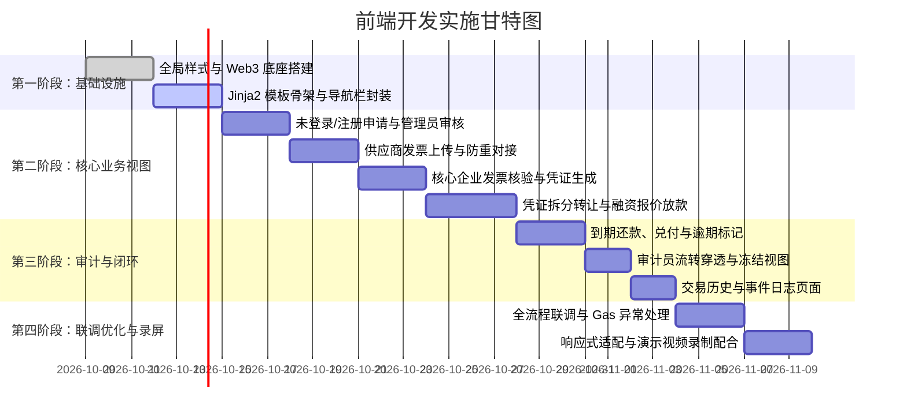

# 前端开发实施计划与排期规范

> **负责人**：成员 3（前端工程师）  
> **面向项目**：NTU SC6113 供应链金融 DApp  
> **依据文档**：`docs/PRD.md` (v1.0)  
> **技术栈**：原生 HTML5 + CSS3 + 现代 JavaScript (ES6+) + Ethers.js (v6) + MetaMask 插件  

---

## 一、前端目标与定位

根据 PRD 规定，所有链上写操作均由前端通过 MetaMask 签名直接与智能合约交互（后端不托管私钥），只读查询与文件存取调用 Flask REST API。

前端需实现 **19 个页面/视图**，覆盖 **5 种业务角色**（管理员、供应商、核心企业、资金方、审计员）及 **未登录/未授权** 状态。全流程保障交易 4 态交互、Gas 预估（F-26）、网络自动检测以及移动端响应式体验。

---

## 二、页面与功能实现矩阵（共 19 个视图）

| 序号 | 角色归属 | 页面 / 视图 | 对应功能编号 | 核心交互与数据源 |
| :---: | :--- | :--- | :---: | :--- |
| **P-01** | 未登录 | 首页 (Landing Page) | F-01 | MetaMask 连接入口、系统核心价值介绍、角色演示快速入口 |
| **P-02** | 未授权 | 企业注册申请页 | F-02 | 表单提交（企业名、联系人、申请角色），API: `POST /api/enterprises`，状态轮询 |
| **P-03** | 供应商 | 供应商仪表盘 | F-23 | 凭证总额、已融资金额、待办发票看板，API: `GET /api/dashboard` |
| **P-04** | 供应商 | 上传发票页 | F-06, F-07 | PDF 文件上传 -> 后端算哈希 -> 调用 `InvoiceRegistry.submitInvoice` 上链 -> 防重校验 |
| **P-05** | 供应商 | 我的发票列表 | F-10 | 状态筛选（待确认/已确认/已拒绝）、PDF 下载比对、API: `GET /api/invoices` |
| **P-06** | 供应商 | 我的应收凭证 | F-11, F-12, F-15 | ERC-1155 凭证卡片、拆分转让弹窗 (`transferReceivable`)、发起融资弹窗 (`requestFinancing`) |
| **P-07** | 供应商 | 我的融资管理 | F-17, F-18 | 报价比选列表、接受报价原子放款 (`acceptQuote`)、取消申请 (`cancelRequest`) |
| **P-08** | 核心企业 | 核心企业仪表盘 | F-23 | 待审核发票数、应付账款总额、临期款项预警图表 |
| **P-09** | 核心企业 | 待确认发票 | F-08, F-09 | 发票 PDF 在线预览、链上确认 (`confirmInvoice`)、拒绝并填写原因 (`rejectInvoice`) |
| **P-10** | 核心企业 | 应付账款清册 | F-19 | 到期发票列表、ERC-20 代币 `approve` 引导、到期全额还款 (`repay`) |
| **P-11** | 资金方 | 资金方仪表盘 | F-23 | 放款总额、待收本息、逾期监控面板 |
| **P-12** | 资金方 | 融资市场 | F-16 | 待报价项目列表、贴现率输入试算（显示供应商到手金额）、链上报价 (`submitQuote`) |
| **P-13** | 资金方 | 我的放款资产 | F-20, F-21 | 持有凭证管理、到期 1:1 兑付 (`redeem`)、逾期标记交易 (`markOverdue`) |
| **P-14** | 审计员 | 全局审计看板 | F-23 | 全平台凭证流转总额、融资总额、违约率图表 |
| **P-15** | 审计员 | 凭证穿透追踪 | F-13, F-14 | 时间线追溯凭证流转路径、链上冻结 (`freeze`) 与解冻 (`unfreeze`) 弹窗 |
| **P-16** | 管理员 | 资质审核管理 | F-03 | 待审核企业列表、调用 `RoleManager.grantRole` 链上核准或填写驳回理由 |
| **P-17** | 管理员 | 角色与系统控制 | F-04, F-05 | 吊销角色 (`revokeRole`)、系统全局紧急暂停/恢复开关 (`pause`/`unpause`) |
| **P-18** | 全部角色 | 交易历史中心 | F-24 | 当前钱包历史交易记录，带 Sepolia Etherscan 区块浏览器外链 |
| **P-19** | 管理员/审计 | 事件日志检索 | F-25 | 17 类链上事件原始日志流，多维筛选（类型/时间/地址） |

---

## 三、前端核心架构与模块划分

```
frontend/
├── static/
│   ├── css/
│   │   ├── base.css          # 全局变量、重置样式、Typography
│   │   ├── layout.css        # Navbar、Sidebar、Grid、Footer 响应式布局
│   │   ├── components.css    # 按钮、卡片、模态框 (Modal)、Badge、Toast 通知
│   │   └── dashboard.css     # 图表容器、数据卡片、时间轴样式
│   ├── js/
│   │   ├── config.js         # 网络配置 (Sepolia ChainID, RPC)、合约地址与常量
│   │   ├── web3-provider.js  # MetaMask 状态管理器 (账户切换、切网监听、Signer)
│   │   ├── contract-client.js# 5 个智能合约的 Ethers.js 封装 (函数调用与 Gas 估算)
│   │   ├── api-client.js     # 统一封装 Fetch 请求至 Flask API (统一错误解析)
│   │   ├── ui-feedback.js    # 统一 4 态交互 Modal、Toast 提示、Gas 预估浮层
│   │   ├── abi/              # 成员 1 导出的 5 个合约 ABI JSON 文件
│   │   │   ├── RoleManager.json
│   │   │   ├── ReceivableToken.json
│   │   │   ├── InvoiceRegistry.json
│   │   │   ├── FinancingPool.json
│   │   │   └── MockStablecoin.json
│   │   └── pages/            # 各角色业务交互逻辑
│   │       ├── supplier.js
│   │       ├── core_enterprise.js
│   │       ├── financier.js
│   │       ├── auditor.js
│   │       └── admin.js
│   └── images/               # 图标与占位素材
└── templates/                # 页面模板 (使用 Jinja2 模板继承)
    ├── base.html             # 全局骨架 (Nav + 钱包状态栏 + 通用 Modal + Footer)
    ├── index.html            # 首页与测试水龙头
    ├── register.html         # 入驻申请
    ├── supplier/             # 供应商 5 个视图
    ├── core_enterprise/      # 核心企业 3 个视图
    ├── financier/            # 资金方 3 个视图
    ├── auditor/              # 审计员 2 个视图
    ├── admin/                # 管理员 2 个视图
    └── common/               # 交易历史与事件日志
```

---

## 四、Web3 关键技术攻坚点与规范

### 1. 链上交易四态生命周期模型（PRD 强项要求）
每次用户触发链上写操作按钮时，前端严禁直接挂起无响应，必须通过统一模态框严格走完四步：
```
[1. 预估 Gas]       ---> 查询 contract.estimateGas 并显示预估费用 (F-26)
        │
[2. 等待钱包确认]   ---> 调起 MetaMask，界面提示“请在 MetaMask 中确认交易...”
        │
[3. 交易上链中]     ---> 获取 tx.hash，显示旋转等待动画并提供 Etherscan 链接
        │
[4. 最终状态反馈]   ---> tx.wait() 成功弹出绿色通知；若失败捕获 Revert Reason 弹出红色警告
```

### 2. 授权前置检查与平滑引导（Approve Flow）
涉及 ERC-20 与 ERC-1155 转移的操作（如资金方接受报价划扣稳定币、供应商锁定凭证、核心企业付款）：
- **逻辑**：发起前先调用 `allowance()` 或 `isApprovedForAll()` 检查授权额度；
- **交互**：额度不足时，按钮自动变为“第一步：授权代币”，用户授权上链确认后，自动解锁“第二步：确认放款/还款”。

### 3. 多角色与多账户自动响应（Account Switching）
- 监听 `ethereum.on('accountsChanged')`：用户在 MetaMask 切换账户后，立即重新请求 `/api/me?address=xxx` 重新判断角色；
- 若角色变更，平滑重定向至对应角色的控制台，若未入驻则引导至注册页；
- 监听 `ethereum.on('chainChanged')`：强制刷新并提示切换至 Sepolia 测试网（Chain ID: `11155111` / `0xaa36a7`）。

### 4. 演示辅助功能（水龙头与角色快捷切换）
- 导航栏放置 **“领取测试币 (Faucet)”** 快捷入口，一键调用 `MockStablecoin.faucet()` 领取 10,000 mUSDT（满足 F-22）；
- 本地开发与演示录制时，提供一个轻量化的 **“角色切换浮窗”**，方便成员 6 录制 8 步主线流程时无需手动繁琐切换助记词。

---

## 五、实施阶段与里程碑排期（4 周倒排推进）



### Week 1：基础搭建与 Web3 底座（Day 1 ~ Day 5）
- [ ] 封装 `web3-provider.js`（MetaMask 连接、断开、账户与网络变更事件监听）；
- [ ] 编写全局 CSS 样式库（色彩规范、卡片、表格、表单控件、Badge、Modal）；
- [ ] 搭建 `base.html` 布局模板（顶部状态条、导航、四态交互 Modal）；
- [ ] 封装统一 `contract-client.js` 与 `api-client.js`。

### Week 2：角色入驻与发票凭证流（Day 6 ~ Day 12）
- [ ] 实现 `P-01 首页`、`P-02 注册申请`、`P-16/17 管理员控制台`；
- [ ] 实现 `P-04 供应商发票上传`（含 PDF 上传本地预览、SHA-256 计算、`submitInvoice` 链上登记）；
- [ ] 实现 `P-09 核心企业待确认发票`（PDF 预览、确认 `confirmInvoice` 与驳回 `rejectInvoice`）；
- [ ] 实现 `P-06 供应商我的凭证`（卡片式展示持有面额、`transferReceivable` 拆分转让弹窗）。

### Week 3：融资、放款、还款与兑付全流程（Day 13 ~ Day 19）
- [ ] 实现 `P-06 发起融资申请` (`requestFinancing`)；
- [ ] 实现 `P-12 资金方融资市场`（报价试算器、`submitQuote` 链上提交）；
- [ ] 实现 `P-07 供应商接受报价`（`acceptQuote` 原子放款校验与执行）；
- [ ] 实现 `P-10 核心企业到期还款` (`repay`) 与 `P-13 凭证持有人兑付` (`redeem`)；
- [ ] 实现 `P-13 逾期标记` (`markOverdue`)。

### Week 4：审计看板、联调打磨与视频录制（Day 20 ~ Day 25）
- [ ] 实现 `P-14/15 审计员全局看板与凭证流转树状追踪`（`freeze`/`unfreeze`）；
- [ ] 实现 `P-18 交易历史` 与 `P-19 事件日志`；
- [ ] 全站移动端响应式测试与断网/切网/拒绝签名等极端异常边界测试；
- [ ] 配合成员 6，按照 PRD 第 3 节“主线 8 步业务流”走通全流程，录制 YouTube 演示视频。

---

## 六、与其他小组成员的协作接口清单

为防止开发冲突与接口脱节，请按以下约定与其他同学对接：

| 协作对象 | 前端需要向其获取的内容 (输入) | 前端需要向其交付的内容 (输出) | 关键对接节点 |
| :---: | :--- | :--- | :--- |
| **成员 1 (合约)** | ① 编译导出的 5 个 ABI JSON 文件<br>② Sepolia 部署后的 5 个合约地址 | 合约调用过程中发现的 Revert 边界、事件参数缺失反馈 | Week 1 末定稿接口，更新至 `static/js/abi/` |
| **成员 2 (后端)** | ① REST API 接口文档 (`docs/api.md`)<br>② 链下 PDF 静态访问 URL | 接口联调入参及字段缺失反馈 | Week 2 初联调发票上传与数据查询 |
| **成员 5 (设计)** | ① 19 个页面的线框图与交互流程草图<br>② 业务流转时序图 | 最终成型的页面 UI 截图供其制作 PPT 与使用手册 | Week 1 中期核对交互视觉 |
| **成员 6 (测试)** | ① 26 项功能的验收用例与测试流程<br>② 缺陷 Bug 清单 | Bug 修复补丁、演示脚本配套的快捷测试辅助按钮 | Week 4 共同录制演示视频 |

---

## 七、前端开发自查清单 (Checklist)

- [ ] MetaMask 未安装时，有清晰的下载引导；
- [ ] 网络非 Sepolia 时，顶部明显警示并支持一键发起切网请求；
- [ ] 所有涉及金额的地方明确单位（区分 Wei 与 mUSDT 显示）；
- [ ] 发起任何链上交易前，弹窗清晰显示预估 Gas 费用（F-26）；
- [ ] 核心企业发票确认、资金方报价、供应商放款等关键节点均有二次确认弹窗；
- [ ] 当智能合约报错时，能解析出人话提示（如“发票号已存在”、“凭证已被冻结”），而非一串裸码堆栈；
- [ ] 页面在 375px（移动端）和 1440px（PC端）分辨率下均无横向滚动条或布局错乱。
